```python
import numpy as np
import matplotlib as mpl
import matplotlib.pyplot as plt
```


```python
plt.plot([1,2,3,4])
plt.ylabel('some numbers')
plt.show()
```


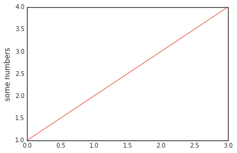


```python
plt.plot([1,2,3,4], [1,4,9,16])
plt.show()
```


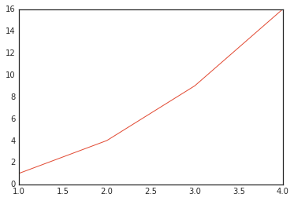


```python
plt.plot([1,2,3,4], [1,4,9,16], 'ro')
plt.axis([0,6,0,20])
plt.show()
```


```python
t = np.arange(0., 5., 0.2)

plt.plot(t, t, 'r--', t, t**2, 'bs', t, t**3, 'g^')
plt.show()
```


```python
x = np.linspace(-np.pi, np.pi)
y = np.sin(x)

plt.plot(x, y, linewidth=2.0, color='r')
plt.show()
```


```python
lines = plt.plot(x, y)

plt.setp(lines, color='r', linewidth=2.0)
plt.setp(lines, 'color', 'r', 'linewidth', 2.0)
plt.show()
```


```python
def f(t): 
    return np.exp(-t) * np.cos(2*np.pi*t)

t1 = np.arange(0.0, 5.0, 0.1)
t2 = np.arange(0.0, 5.0, 0.02)

plt.figure(1)
plt.subplot(211)
plt.plot(t1, f(t1), 'bo', t2, f(t2), 'k')
plt.subplot(212)
plt.plot(t2, np.cos(2*np.pi*t2), 'r--')
plt.show()
```


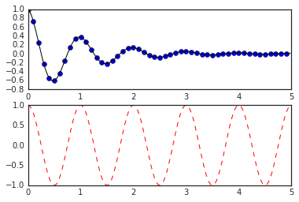


```python
mu, sigma = 100, 15
x = mu + sigma * np.random.randn(10000)
n, bins, patches = plt.hist(x, 50, normed=1, facecolor='g', alpha=0.75)

plt.xlabel('Smarts')
plt.ylabel('Probability')
plt.title('Histogram of IQ')
plt.text(60, .025, r'$\mu=100,\ \sigma=15$')
plt.axis([40, 160, 0, 0.03])
plt.grid(True)
plt.show()
```


```python
ax = plt.subplot(111)
t = np.arange(0.0, 5.0, 0.01)
s = np.cos(2*np.pi*t)
line, = plt.plot(t, s, lw=2)

plt.annotate('local max', xy=(2, 1), xytext=(3, 1.5), arrowprops=dict(facecolor='black', shrink=0.05))
plt.ylim(-2,2)
plt.show()
```


```python
x = np.linspace(0, 2 * np.pi)
y = np.sin(x)

plt.plot(x, y)
plt.show()
```


```python
plt.style.use('ggplot')
plt.plot(x, y, 'r-o')
plt.show()
```


```python
fig = plt.figure()
ax = fig.add_subplot(111, polar=True)
r = np.arange(0,1,0.001)
theta = 2*2*np.pi*r
line, = ax.plot(theta, r, color='#ee8d18', lw=3)
ind = 800
thisr, thistheta = r[ind], theta[ind]
ax.plot([thistheta], [thisr], 'o')
ax.annotate('a polar annotation', xy=(thistheta, thisr), xytext=(0.05, 0.05), textcoords='figure fraction',
            arrowprops=dict(facecolor='black', shrink=0.05), horizontalalignment='left', verticalalignment='bottom')
plt.show()
```


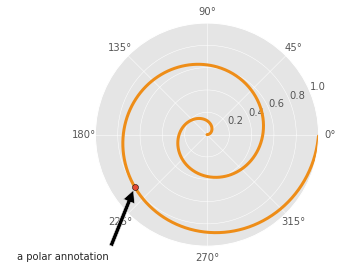


```python
t = np.arange(0.0, 2.0, 0.01)
s = np.sin(2*np.pi*t)

plt.plot(t,s)
plt.title(r'$\alpha_i > \beta_i$', fontsize=20)
plt.text(1, -0.6, r'$\sum_{i=0}^\infty x_i$', fontsize=20)
plt.text(0.6, 0.6, r'$\mathcal{A}\ \mathrm{sin}(2 \omega t)$', fontsize=20)
plt.xlabel('time (s)')
plt.ylabel('volts (mV)')
plt.show()
```


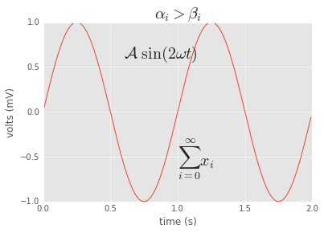


```python
plt.style.use('seaborn-white')
import matplotlib.image as mpimg
img = mpimg.imread('lenna.png')
print("img.shape: {}".format(img.shape))
print("img.dtype: {}".format(img.dtype))
```

    img.shape: (512, 512, 3)
    img.dtype: float32


```python
imgplot = plt.imshow(img)
```


```python
lum_img = img[:,:,0]
imgplot = plt.imshow(lum_img)
```


```python
imgplot = plt.imshow(lum_img)
imgplot.set_cmap('hot')
```


```python
imgplot = plt.imshow(lum_img)
imgplot.set_cmap('spectral')
```


```python
imgplot = plt.imshow(lum_img)
imgplot.set_cmap('spectral')
plt.colorbar()
plt.show()
```


```python
plt.hist(lum_img.flatten(), 256, range=(0.0,1.0), fc='k', ec='k')
plt.show()
```


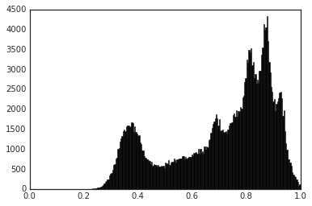


```python
imgplot = plt.imshow(lum_img)
imgplot.set_clim(0.0,0.7)
```


```python
fig = plt.figure(1, figsize=(5,5))
fig.clf()

ax = fig.add_subplot(111)
ax.set_aspect(1)

x1 = -1 + np.random.randn(100)
y1 = -1 + np.random.randn(100)
x2 = 1. + np.random.randn(100)
y2 = 1. + np.random.randn(100)

ax.scatter(x1, y1, color="r")
ax.scatter(x2, y2, color="g")

bbox_props = dict(boxstyle="round", fc="w", ec="0.5", alpha=0.9)
ax.text(-2, -2, "Sample A", ha="center", va="center", size=20, bbox=bbox_props)
ax.text(2, 2, "Sample B", ha="center", va="center", size=20, bbox=bbox_props)

bbox_props = dict(boxstyle="rarrow", fc=(0.8,0.9,0.9), ec="b", lw=2)
t = ax.text(0, 0, "Direction", ha="center", va="center", rotation=45, size=15, bbox=bbox_props)

bb = t.get_bbox_patch()
bb.set_boxstyle("rarrow", pad=0.6)

ax.set_xlim(-4, 4)
ax.set_ylim(-4, 4)

plt.show()
```


```python
import matplotlib.patches as mpatch
x1, y1 = 0.3, 0.3
x2, y2 = 0.7, 0.7

fig = plt.figure(1, figsize=(8,3))
fig.clf()
from mpl_toolkits.axes_grid.axes_grid import AxesGrid
from mpl_toolkits.axes_grid.anchored_artists import AnchoredText

def add_at(ax, t, loc=2):
    fp = dict(size=10)
    _at = AnchoredText(t, loc=loc, prop=fp)
    ax.add_artist(_at)
    return _at

grid = AxesGrid(fig, 111, (1, 4), label_mode="1", share_all=True)
grid[0].set_autoscale_on(False)
ax = grid[0]
ax.plot([x1, x2], [y1, y2], ".")
el = mpatch.Ellipse((x1, y1), 0.3, 0.4, angle=30, alpha=0.2)
ax.add_artist(el)
ax.annotate("", xy=(x1, y1), xycoords='data', xytext=(x2, y2), textcoords='data',
            arrowprops=dict(arrowstyle="-", color="0.5", patchB=None, shrinkB=0,connectionstyle="arc3,rad=0.3"))

add_at(ax, "connect", loc=2)
ax = grid[1]
ax.plot([x1, x2], [y1, y2], ".")
el = mpatch.Ellipse((x1, y1), 0.3, 0.4, angle=30, alpha=0.2)
ax.add_artist(el)
ax.annotate("", xy=(x1, y1), xycoords='data', xytext=(x2, y2), textcoords='data',
            arrowprops=dict(arrowstyle="-", color="0.5", patchB=el, shrinkB=0, connectionstyle="arc3,rad=0.3"))

add_at(ax, "clip", loc=2)
ax = grid[2]
ax.plot([x1, x2], [y1, y2], ".")
el = mpatch.Ellipse((x1, y1), 0.3, 0.4, angle=30, alpha=0.2)
ax.add_artist(el)
ax.annotate("", xy=(x1, y1), xycoords='data', xytext=(x2, y2), textcoords='data',
            arrowprops=dict(arrowstyle="-", color="0.5", patchB=el, shrinkB=5, connectionstyle="arc3,rad=0.3"))

add_at(ax, "shrink", loc=2)
ax = grid[3]
ax.plot([x1, x2], [y1, y2], ".")
el = mpatch.Ellipse((x1, y1), 0.3, 0.4, angle=30, alpha=0.2)
ax.add_artist(el)
ax.annotate("", xy=(x1, y1), xycoords='data', xytext=(x2, y2), textcoords='data',
            arrowprops=dict(arrowstyle="fancy", color="0.5", patchB=el, shrinkB=5, connectionstyle="arc3,rad=0.3"))

add_at(ax, "mutate", loc=2)
grid[0].set_xlim(0, 1)
grid[0].set_ylim(0, 1)
grid[0].axis["bottom"].toggle(ticklabels=False)
grid[0].axis["left"].toggle(ticklabels=False)
fig.subplots_adjust(left=0.05, right=0.95, bottom=0.05, top=0.95)

plt.draw()
plt.show()
```


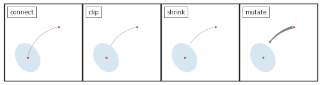


```python
line_up, = plt.plot([1,2,3], label='Line 2')
line_down, = plt.plot([3,2,1], label='Line 1')
plt.legend(handles=[line_up, line_down])
plt.show()
```


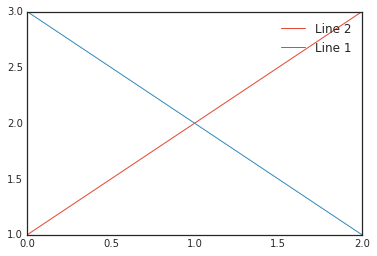


```python
plt.subplot(211)
plt.plot([1,2,3], label="test1")
plt.plot([3,2,1], label="test2")
plt.legend(bbox_to_anchor=(0., 1.02, 1., .102), loc=3, ncol=2, mode="expand", borderaxespad=0.)
plt.subplot(223)
plt.plot([1,2,3], label="test1")
plt.plot([3,2,1], label="test2")
plt.legend(bbox_to_anchor=(1.05, 1), loc=2, borderaxespad=0.)
plt.show()
```


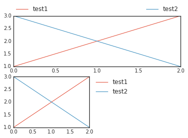


```python
line1, = plt.plot([1,2,3], label="Line 1", linestyle='--')
line2, = plt.plot([3,2,1], label="Line 2", linewidth=4)
first_legend = plt.legend(handles=[line1], loc=1)
ax = plt.gca().add_artist(first_legend)
plt.legend(handles=[line2], loc=4)
plt.show()
```


```python
z = np.random.randn(10)
red_dot, = plt.plot(z, "ro", markersize=15)
white_cross, = plt.plot(z[:5], "w+", markeredgewidth=3, markersize=15)
plt.legend([red_dot, (red_dot, white_cross)], ["Attr A", "Attr A+B"])
plt.show()
```


```python
from matplotlib.legend_handler import HandlerPatch
class HandlerEllipse(HandlerPatch):
    def create_artists(self, legend, orig_handle, xdescent, ydescent, width, height, fontsize, trans):
        center = 0.5 * width - 0.5 * xdescent, 0.5 * height - 0.5 * ydescent
        p = mpatch.Ellipse(xy=center, width=width + xdescent, height=height + ydescent)
        self.update_prop(p, orig_handle, legend)
        p.set_transform(trans)
        return [p]

c = mpatch.Circle((0.5, 0.5), 0.25, facecolor="green", edgecolor="red", linewidth=3)
plt.gca().add_patch(c)
plt.legend([c], ["An ellipse, not a rectangle"], handler_map={mpatch.Circle: HandlerEllipse()})
plt.show()
```


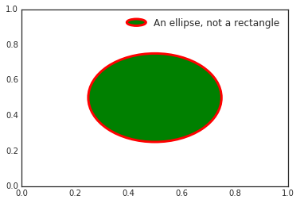


```python
plt.subplot(2,1,1)
plt.xticks([]), plt.yticks([])
plt.text(0.5,0.5, 'subplot(2,1,1)',ha='center',va='center',size=24,alpha=.5)
plt.subplot(2,1,2)
plt.xticks([]), plt.yticks([])
plt.text(0.5,0.5, 'subplot(2,1,2)',ha='center',va='center',size=24,alpha=.5)
plt.show()
```


```python
x = np.linspace(-np.pi, np.pi)
c, s = np.cos(x), np.sin(x)
p = plt.plot(x,c)
p = plt.plot(x,s)
plt.show()
```


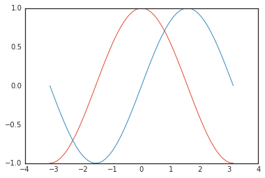


```python
plt.figure(figsize=(10,6), dpi=80)
plt.plot(x, c, 'b-', x, s, 'r-', linewidth=2.5)
plt.xlim(x.min() * 1.1, x.max() * 1.1)
plt.ylim(c.min() * 1.1, c.max() * 1.1)

ax = plt.gca()
ax.spines['right'].set_color('none')
ax.spines['top'].set_color('none')
ax.xaxis.set_ticks_position('bottom')
ax.spines['bottom'].set_position(('data',0))
ax.yaxis.set_ticks_position('left')
ax.spines['left'].set_position(('data',0))

plt.xticks([-np.pi, -np.pi/2, 0, np.pi/2, np.pi], ['$-\pi$', '$-\pi/2$', '$0$', '$\pi/2$', '$\pi$'], fontsize ='xx-large')
plt.yticks([-1, 0, 1], ['$-1$', '$0$', '$+1$'], fontsize ='xx-large')

l = plt.legend(['cosine', 'sine'], loc='upper left', frameon=False)
t = 2 * np.pi / 3

plt.plot([t,t],[0,np.cos(t)], color ='blue', linewidth=2.5, linestyle="--")
plt.scatter([t,],[np.cos(t),], 50, color ='blue')
plt.annotate(r'$\sin(\frac{2\pi}{3})=\frac{\sqrt{3}}{2}$', xy=(t, np.sin(t)), xycoords='data', xytext=(+10, +30), 
             textcoords='offset points', fontsize=16, arrowprops=dict(arrowstyle="->", connectionstyle="arc3,rad=.2")) 

p = plt.plot([t,t],[0,np.sin(t)], color ='red', linewidth=2.5, linestyle="--")
p = plt.scatter([t,],[np.sin(t),], 50, color ='red')
p = plt.annotate(r'$\cos(\frac{2\pi}{3})=-\frac{1}{2}$', xy=(t, np.cos(t)), xycoords='data', xytext=(-90, -50), 
                 textcoords='offset points', fontsize=16, arrowprops=dict(arrowstyle="->", connectionstyle="arc3,rad=.2"))

for label in ax.get_xticklabels() + ax.get_yticklabels():
    label.set_fontsize(16)
    label.set_bbox(dict(facecolor='white', edgecolor='None', alpha=0.65 ))
plt.show()
```


```python
t = np.arange(0.0, 2.0, 0.01)
s = np.sin(2*np.pi*t)
plt.plot(t, s)
plt.xlabel('time (s)')
plt.ylabel('voltage (mV)')
plt.title('About as simple as it gets, folks')
plt.grid(True)
plt.show()
```


```python
x1 = np.linspace(0.0, 5.0)
x2 = np.linspace(0.0, 2.0)

y1 = np.cos(2 * np.pi * x1) * np.exp(-x1)
y2 = np.cos(2 * np.pi * x2)

plt.subplot(2, 1, 1)
plt.plot(x1, y1, 'yo-')
plt.title('A tale of 2 subplots')
plt.ylabel('Damped oscillation')

plt.subplot(2, 1, 2)
plt.plot(x2, y2, 'r.-')
plt.xlabel('time (s)')
plt.ylabel('Undamped')

plt.show()
```


```python
import matplotlib.mlab as mlab
mu = 100 
sigma = 15 
x = mu + sigma * np.random.randn(10000)

num_bins = 50
n, bins, patches = plt.hist(x, num_bins, normed=1, facecolor='green', alpha=0.5)
y = mlab.normpdf(bins, mu, sigma)
plt.plot(bins, y, 'r--')
plt.xlabel('Smarts')
plt.ylabel('Probability')
plt.title(r'Histogram of IQ: $\mu=100$, $\sigma=15$')
plt.subplots_adjust(left=0.15)
plt.show()
```


```python
import matplotlib.path as mpath
fig, ax = plt.subplots()

Path = mpath.Path
path_data = [
    (Path.MOVETO, (1.58, -2.57)),
    (Path.CURVE4, (0.35, -1.1)),
    (Path.CURVE4, (-1.75, 2.0)),
    (Path.CURVE4, (0.375, 2.0)),
    (Path.LINETO, (0.85, 1.15)),
    (Path.CURVE4, (2.2, 3.2)),
    (Path.CURVE4, (3, 0.05)),
    (Path.CURVE4, (2.0, -0.5)),
    (Path.CLOSEPOLY, (1.58, -2.57)),
    ]
codes, verts = zip(*path_data)
path = mpath.Path(verts, codes)
patch = mpatch.PathPatch(path, facecolor='r', alpha=0.5)
ax.add_patch(patch)

x, y = zip(*path.vertices)
line, = ax.plot(x, y, 'go-')

ax.grid()
ax.axis('equal')
plt.show()
```


```python
from mpl_toolkits.mplot3d import Axes3D
from matplotlib import cm
from matplotlib.ticker import LinearLocator, FormatStrFormatter

fig = plt.figure()
ax = fig.gca(projection='3d')
X = np.arange(-5, 5, 0.25)
Y = np.arange(-5, 5, 0.25)
X, Y = np.meshgrid(X, Y)
R = np.sqrt(X**2 + Y**2)
Z = np.sin(R)

surf = ax.plot_surface(X, Y, Z, rstride=1, cstride=1, cmap=cm.coolwarm, linewidth=0, antialiased=False)
ax.set_zlim(-1.01, 1.01)
ax.zaxis.set_major_locator(LinearLocator(10))
ax.zaxis.set_major_formatter(FormatStrFormatter('%.02f'))
fig.colorbar(surf, shrink=0.5, aspect=5)

plt.show()
```


```python
Y, X = np.mgrid[-3:3:100j, -3:3:100j]
U = -1 - X**2 + Y
V = 1 + X - Y**2
speed = np.sqrt(U*U + V*V)

plt.streamplot(X, Y, U, V, color=U, linewidth=2, cmap=plt.cm.autumn)
plt.colorbar()

f, (ax1, ax2) = plt.subplots(ncols=2)
ax1.streamplot(X, Y, U, V, density=[0.5, 1])

lw = 5*speed/speed.max()
ax2.streamplot(X, Y, U, V, density=0.6, color='k', linewidth=lw)

plt.show()
```


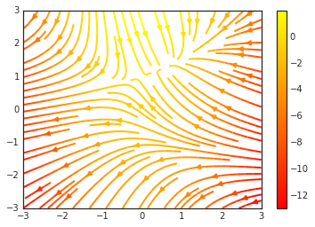


```python
from pylab import figure, show, rand
from matplotlib.patches import Ellipse

NUM = 250
ells = [Ellipse(xy=rand(2)*10, width=rand(), height=rand(), angle=rand()*360) for i in range(NUM)]
fig = figure()
ax = fig.add_subplot(111, aspect='equal')
for e in ells:
    ax.add_artist(e)
    e.set_clip_box(ax.bbox)
    e.set_alpha(rand())
    e.set_facecolor(rand(3))

ax.set_xlim(0, 10)
ax.set_ylim(0, 10)
plt.show()
```


```python
n_groups = 5

means_men = (20, 35, 30, 35, 27)
std_men = (2, 3, 4, 1, 2)
means_women = (25, 32, 34, 20, 25)
std_women = (3, 5, 2, 3, 3)

fig, ax = plt.subplots()
index = np.arange(n_groups)
bar_width = 0.35

opacity = 0.4
error_config = {'ecolor': '0.3'}

rects1 = plt.bar(index, means_men, bar_width, alpha=opacity, color='b', yerr=std_men, error_kw=error_config, label='Men')
rects2 = plt.bar(index + bar_width, means_women, bar_width, alpha=opacity, color='r', yerr=std_women, error_kw=error_config, label='Women')

plt.xlabel('Group')
plt.ylabel('Scores')
plt.title('Scores by group and gender')
plt.xticks(index + bar_width, ('A', 'B', 'C', 'D', 'E'))
plt.legend()

plt.tight_layout()
plt.show()
```


```python
labels = 'Frogs', 'Hogs', 'Dogs', 'Logs'
sizes = [15, 30, 45, 10]
colors = ['yellowgreen', 'gold', 'lightskyblue', 'lightcoral']
explode = (0, 0.1, 0, 0) # only "explode" the 2nd slice (i.e. 'Hogs')
plt.pie(sizes, explode=explode, labels=labels, colors=colors, autopct='%1.1f%%', shadow=True, startangle=90)
plt.axis('equal')
plt.show()
```


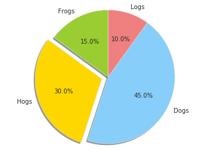


```python
data = [[  66386,  174296,   75131,  577908,   32015],
        [  58230,  381139,   78045,   99308,  160454],
        [  89135,   80552,  152558,  497981,  603535],
        [  78415,   81858,  150656,  193263,   69638],
        [ 139361,  331509,  343164,  781380,   52269]]

columns = ('Freeze', 'Wind', 'Flood', 'Quake', 'Hail')
rows = ['%d year' % x for x in (100, 50, 20, 10, 5)]
values = np.arange(0, 2500, 500)
value_increment = 1000
colors = plt.cm.BuPu(np.linspace(0, 0.5, len(columns)))
n_rows = len(data)
index = np.arange(len(columns)) + 0.3
bar_width = 0.4
y_offset = np.array([0.0] * len(columns))

cell_text = []
for row in range(n_rows):
    plt.bar(index, data[row], bar_width, bottom=y_offset, color=colors[row])
    y_offset = y_offset + data[row]
    cell_text.append(['%1.1f' % (x/1000.0) for x in y_offset])
colors = colors[::-1]
cell_text.reverse()

the_table = plt.table(cellText=cell_text, rowLabels=rows, rowColours=colors, colLabels=columns, loc='bottom')

plt.subplots_adjust(left=0.2, bottom=0.2)
plt.ylabel("Loss in ${0}'s".format(value_increment))
plt.yticks(values * value_increment, ['%d' % val for val in values])
plt.xticks([])
plt.title('Loss by Disaster')
plt.show()
```


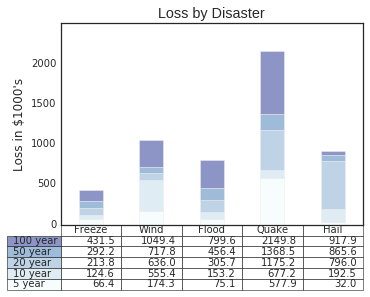


```python
import matplotlib.cbook as cbook

datafile = cbook.get_sample_data('goog.npy')
price_data = np.load(datafile, encoding='bytes').view(np.recarray)
price_data = price_data[-250:] 
delta1 = np.diff(price_data.adj_close)/price_data.adj_close[:-1]

volume = (15 * price_data.volume[:-2] / price_data.volume[0])**2
close = 0.003 * price_data.close[:-2] / 0.003 * price_data.open[:-2]

fig, ax = plt.subplots()
ax.scatter(delta1[:-1], delta1[1:], c=close, s=volume, alpha=0.5)

ax.set_xlabel(r'$\Delta_i$', fontsize=20)
ax.set_ylabel(r'$\Delta_{i+1}$', fontsize=20)
ax.set_title('Volume and percent change')

ax.grid(True)
fig.tight_layout()

plt.show()
```


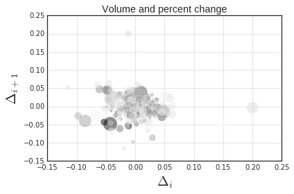


```python
from matplotlib.widgets import Slider, Button, RadioButtons
fig, ax = plt.subplots()
plt.subplots_adjust(left=0.25, bottom=0.25)
t = np.arange(0.0, 1.0, 0.001)
a0 = 5
f0 = 3
s = a0*np.sin(2*np.pi*f0*t)
l, = plt.plot(t,s, lw=2, color='red')
plt.axis([0, 1, -10, 10])

axcolor = 'lightgoldenrodyellow'
axfreq = plt.axes([0.25, 0.1, 0.65, 0.03], axisbg=axcolor)
axamp  = plt.axes([0.25, 0.15, 0.65, 0.03], axisbg=axcolor)

sfreq = Slider(axfreq, 'Freq', 0.1, 30.0, valinit=f0)
samp = Slider(axamp, 'Amp', 0.1, 10.0, valinit=a0)

def update(val):
    amp = samp.val
    freq = sfreq.val
    l.set_ydata(amp*np.sin(2*np.pi*freq*t))
    fig.canvas.draw_idle()
sfreq.on_changed(update)
samp.on_changed(update)

resetax = plt.axes([0.8, 0.025, 0.1, 0.04])
button = Button(resetax, 'Reset', color=axcolor, hovercolor='0.975')
def reset(event):
    sfreq.reset()
    samp.reset()
button.on_clicked(reset)

rax = plt.axes([0.025, 0.5, 0.15, 0.15], axisbg=axcolor)
radio = RadioButtons(rax, ('red', 'blue', 'green'), active=0)
def colorfunc(label):
    l.set_color(label)
    fig.canvas.draw_idle()
radio.on_clicked(colorfunc)
plt.show()
```


```python
x = np.linspace(0, 1)
y = np.sin(4 * np.pi * x) * np.exp(-5 * x)
plt.fill(x, y, 'r')
plt.grid(True)
plt.show()
```


```python
import datetime
import matplotlib.dates as mdates
import matplotlib.cbook as cbook

years    = mdates.YearLocator() 
months   = mdates.MonthLocator()
yearsFmt = mdates.DateFormatter('%Y')

datafile = cbook.get_sample_data('goog.npy')
r = np.load(datafile, encoding='bytes').view(np.recarray)
fig, ax = plt.subplots()
ax.plot(r.date, r.adj_close)

ax.xaxis.set_major_locator(years)
ax.xaxis.set_major_formatter(yearsFmt)
ax.xaxis.set_minor_locator(months)

datemin = datetime.date(r.date.min().year, 1, 1)
datemax = datetime.date(r.date.max().year+1, 1, 1)
ax.set_xlim(datemin, datemax)

def price(x): return '$%1.2f'%x
ax.format_xdata = mdates.DateFormatter('%Y-%m-%d')
ax.format_ydata = price
ax.grid(True)

fig.autofmt_xdate()
plt.show()
```


```python
plt.subplots_adjust(hspace=0.4)
t = np.arange(0.01, 20.0, 0.01)

plt.subplot(221)
plt.semilogy(t, np.exp(-t/5.0))
plt.title('semilogy')
plt.grid(True)

plt.subplot(222)
plt.semilogx(t, np.sin(2*np.pi*t))
plt.title('semilogx')
plt.grid(True)

plt.subplot(223)
plt.loglog(t, 20*np.exp(-t/10.0), basex=2)
plt.grid(True)
plt.title('loglog base 4 on x')

ax = plt.subplot(224)
ax.set_xscale("log", nonposx='clip')
ax.set_yscale("log", nonposy='clip')

x = 10.0**np.linspace(0.0, 2.0, 20)
y = x**2.0
plt.errorbar(x, y, xerr=0.1*x, yerr=5.0+0.75*y)
ax.set_ylim(ymin=0.1)
ax.set_title('Errorbars go negative')

plt.show()
```


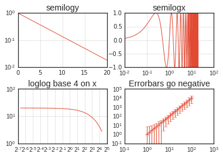


```python
r = np.arange(0, 3.0, 0.01)
theta = 2 * np.pi * r

ax = plt.subplot(111, polar=True)
ax.plot(theta, r, color='r', linewidth=3)
ax.set_rmax(2.0)
ax.grid(True)

ax.set_title("A line plot on a polar axis", va='bottom')
plt.show()
```


```python
a = b = np.arange(0,3, .02)
c = np.exp(a)
d = c[::-1]

plt.plot(a, c, 'k--', label='Model length')
plt.plot(a, d, 'k:', label='Data length')
plt.plot(a, c+d, 'k', label='Total message length')

legend = plt.legend(loc='upper center', shadow=True, fontsize='x-large')
legend.get_frame().set_facecolor('#00FFCC')
plt.show()
```


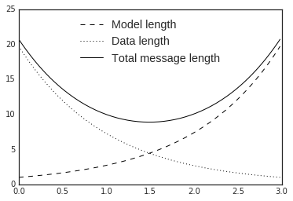

